# Рабочие заметки по проекту (генерация персонажей + приложение)

> Живой документ. Сюда складываем всё, о чём договорились, чтобы не потерять между вопросами.

---

## 1. БЛОЧНАЯ СИСТЕМА ПРОМТА (на 6 слоёв)

Старая система была 3 блока (STYLE / CHARACTER / COMPOSITION). Новая разбивает
CHARACTER на FACE + BODY, выносит одежду в OUTFIT и добавляет EXPRESSION.

```
[STYLE]       — стиль. Заморожен с самого начала, не трогаем НИКОГДА.
[FACE]        — лицо: ТОЛЬКО анатомия (форма, нос, губы, глаза, волосы, кожа).
                БЕЗ выражения. Крутим на этапе 1, замораживаем после утверждения.
[BODY]        — тело: телосложение, рост (относительно!), особые приметы.
                То, что ПОД одеждой и не меняется. Замораживаем после утверждения.
[OUTFIT]      — костюм. "Липкий": фиксируется на сцену, меняется между сценами.
                НЕ замораживается насовсем (иначе застрянешь в одном наряде).
[EXPRESSION]  — эмоция СЛОВОМ (angry, smiling, shouting). Меняется. Капризная.
                На этапе утверждения канона = neutral.
[COMPOSITION] — поза (сидит/стоит/идёт) + ракурс + кадр + фон. Меняется каждый кадр.
```

ПРАВИЛО ЗАВЕДЕНИЯ СЛОЯ: слой заводим только для того, что (а) замораживается
отдельно, либо (б) требует особого обращения. Всё остальное — в COMPOSITION.
6 слоёв — потолок, дальше не дробить. Поза сидя/стоя/в движении = COMPOSITION,
НЕ новый слой.

### Порядок утверждения (заморозки)
1. STYLE — заморожен сразу (с момента выбора стиля).
2. FACE — после того как лицо понравилось.
3. BODY — после того как тело/рост понравились.
4. OUTFIT — фиксируется на сцену, но не насовсем.
5. EXPRESSION и COMPOSITION — всегда переменные.

### КРИТИЧНО: почему FACE только анатомия
Если в [FACE] написать "calm neutral expression" или "brooding gaze" — это ВЫРАЖЕНИЕ,
оно дерётся с блоком [EXPRESSION]. Поэтому в [FACE] оставляем только органы и форму:
- ✅ "broad nose, full lips, deep-set dark eyes, short rough dark hair, weathered skin"
- ❌ "brooding gaze, calm expression" (это выражение — выносим в EXPRESSION)

Пример [FACE] (Герон):
```
[FACE — lock, anatomy only]
A man in his early thirties, coarse face, broad nose, full lips, deep-set dark
eyes, short rough dark hair, weathered tanned skin.
```

Пример [BODY] (Герон):
```
[BODY — lock after approval]
Stocky and powerfully built, broad shoulders, thick muscular arms, short and
heavy frame. A faded tattoo on the left forearm.
```

---

## 2. ПРО РОСТ — фундаментальное ограничение (ВАЖНО, в инструкцию заметкой)

Модель НЕ знает абсолютных размеров. Не понимает "183 см" или "низкий рост" как
абсолют. Каждую картинку генерит изолированно, без системы отсчёта между персонажами.

- ✅ Работает: относительные слова в [BODY] — "short and stocky" / "tall and lean".
  Влияет на ПРОПОРЦИИ (приземистый vs вытянутый), слабо.
- ❌ НЕ работает: заставить модель помнить, что Герон выше Тайры, и в совместном
  кадре поставить голову одного на уровень плеча другого. У модели нет памяти о
  других персонажах.

### Как держат рост на практике (НЕ через канон персонажа):
1. Совместные кадры — задаёшь разницу ВНУТРИ одного промта:
   "two men standing side by side, the man on the left is a full head taller than
   the man on the right, height difference clearly visible"
2. ControlNet OpenPose — рисуешь скелеты нужных ростов/поз, модель подставляет.
3. Ручная сборка — генеришь по отдельности, масштабируешь и компонуешь в редакторе.
   Для графического романа это нормальная практика.

### Вывод для LoRA:
Рост в LoRA почти не закладывается. LoRA учит лицо и телосложение (пропорции), но
НЕ абсолютный масштаб. Рост задаётся на этапе РАСКАДРОВКИ СЦЕНЫ, кадр за кадром.
Не ждать, что [BODY] удержит рост между кадрами — он и не должен.

---

## 3. ЭМОЦИИ — как генератор их ест

- Пишем НАЗВАНИЕ эмоции словом, НЕ описание мимики.
  - ✅ angry, laughing, shouting, surprised, crying, smirking
  - ❌ "брови сведены, губы поджаты" (избыточно, иногда сбивает)
- Можно усиливать интенсивностью: "slightly amused", "furious, screaming",
  "gently smiling".
- Эмоция идёт в отдельный блок [EXPRESSION], НЕ в [FACE] (там только анатомия) и
  НЕ в [COMPOSITION].
- Реф лица (заблокированный) держит ЧЕРТЫ, эмоция меняет МИМИКУ поверх них.
  Nano Banana это тянет ("отделяет геометрию от выражения").

### Предупреждение по эмоциям:
При сильных эмоциях (крик, широкая улыбка) лицо немного "уезжает" даже у Баναны —
рот растягивается, идентичность чуть плывёт. Эмоциональные кадры — самые капризные
по консистентности, отбирать руками жёстче.

---

## 3.5. ОДЕЖДА (OUTFIT) и КОНФЛИКТ РЕФЕРЕНСОВ

### Одежда — отдельный слой [OUTFIT], не часть [BODY]
- Тело постоянно (пузо при нём всегда), костюмов много. Если впихнуть одежду в BODY
  и заморозить — застрянешь в одном наряде (ловушка "впекания костюма").
- Приметы из [BODY] проступают сквозь одежду — Банана понимает, что тело под тканью
  одно и то же. НО:
  - Лёгкая/облегающая одежда (рубаха, туника, голый торс) → пузо/тату видно.
  - Объёмная/жёсткая (латы, кираса, толстый плащ) → может СКРЫТЬ силуэт (как в реале).
    Хочешь видеть пузо под бронёй — пиши явно: "armor straining over his belly".

### ПРОБЛЕМА: реф "в полный рост" в старом костюме конфликтует с новым костюмом
Если крепишь полноростовой реф в синей тунике, а в промте просишь золотые латы —
модель получает противоречие (картинка=туника, текст=латы). Банана сильно слушает
картинку и может: оставить тунику / сделать кашу-гибрид / подтянуть к цвету рефа.

РЕШЕНИЕ — референсы крепятся РОЛЯМИ, а не "все утверждённые подряд":
- реф лица → "бери ТОЛЬКО лицо/идентичность"
- реф тела → "бери телосложение и пропорции, НЕ бери одежду"
- реф стиля → "бери только манеру"
- В тексте к генерации ЯВНО гасим костюмный конфликт, когда OUTFIT отличается от рефов:
  "use the attached images ONLY for face identity and body build. IGNORE the clothing
   in the references — the character now wears [новый костюм]."

ИДЕАЛЬНО: на фазе утверждения завести отдельный НЕЙТРАЛЬНЫЙ полноростовой реф —
персонаж в максимально простой/облегающей одежде. Несёт тело с минимумом костюмного
шума, поверх легче надевать любой наряд текстом.

СЛЕДСТВИЕ ДЛЯ ПРИЛОЖЕНИЯ: вместо "прикрепи 4 фотки по порядку" логика становится
"прикрепи фото лица + фото тела + укажи их роли в тексте + погаси костюмный конфликт".

### КОМБИНИРОВАНИЕ ОСЕЙ (экономия): эмоция + костюм + поза за раз
- Можно. Для ДАТАСЕТА даже хорошо (вариативность по всем осям сразу).
- Цена: чем больше осей меняешь за раз, тем выше брак и тем НЕПОНЯТНЕЕ что сломалось.
- ПРАВИЛО:
  - Фаза утверждения канона → меняй по ОДНОЙ оси (видно причину брака).
  - Фаза набора датасета → комбинируй смело (берёшь массой, отбираешь).
    Экономия: вместо "10 поз × 6 эмоций = 60" делаешь 15-20 комбинированных.
- ОСТОРОЖНО: эмоция — самая хрупкая ось. Сильную эмоцию (крик) + экстремальную позу +
  смену костюма разом = много брака. Сильные эмоции гонять на спокойной композиции.
- Для приложения: массив композиций на финальной фазе может нести позу+эмоцию+костюм
  в одном элементе.

---

## 4. ПРИЛОЖЕНИЕ — архитектура и решения

### Общая идея флоу (мастер по шагам):

ВСЕ паспортные шаги ОБЯЗАТЕЛЬНЫ — пропуска/скипа страниц нет. Подкрутить состав можно
на странице описания персонажа, но пройти надо все 5 паспортных кадров.

Порядок паспортных кадров (КАНОН, см. файл решений HLE-661, Решения 1/6/7):
**фас-портрет → фас полный рост → профиль-портрет → спина полный рост → 3/4 полный рост.**
Первые два = «базовый паспорт» (на них замораживаются FACE и BODY и они крепятся рефами).
Остальные три — обязательный минимум покрытия, генерим и утверждаем, но рефами НЕ крепим.

0. Грузишь текст (поле или файл) → LLM извлекает персонажей → список имён.
1. Если [STYLE] ещё не утверждён: грузишь ~5 фоток стиля → LLM пишет промт стиля →
   утверждаешь. [STYLE] заморожен. (Если стиль уже утверждён — пропускаем.)
2. Кликаешь персонажа → табличка данных + блок «Эмоции» (опц.) + «Базовая эмоция» (опц.)
   + поля промта (FACE/BODY и т.д.).
3. **ШАГ 1 — Фас-портрет (крутим FACE).** Промт собирается автоматом
   (STYLE + данные + COMPOSITION «фас-портрет» + EXPRESSION neutral), LLM оптимизирует
   [FACE] под модель; к генератору уходит промт + реф стиля (утверждённых рефов ещё нет) →
   превью. Здесь крутим ЛИЦО.
   Утвердил → **[FACE] заморожен**, кадр дальше крепится как **РЕФ ЛИЦА** (роль «только
   идентичность лица»).
4. **ШАГ 2 — Фас полный рост (крутим BODY).** Лицо уже держит реф лица; крутим [BODY].
   Утвердил → **[BODY] заморожен**, кадр дальше крепится как **РЕФ ТЕЛА** (роль
   «телосложение/пропорции, НЕ одежда»).
   → Эти два = базовый паспорт. С этого момента к КАЖДОЙ генерации крепим 2 рефа РОЛЯМИ
     (лицо + тело) + реф стиля и явно гасим костюмный конфликт (§3.5). НЕ «все утверждённые
     фотки в порядке утверждения».
5. **ШАГ 3 — профиль-портрет (строгий 90°).** **ШАГ 4 — спина, полный рост.**
   **ШАГ 5 — 3/4, полный рост.** Все три — обязательны, neutral, серый фон; генерим и
   утверждаем, но рефами НЕ крепим (нужны для покрытия под локалку, Решения 1 и 7).
   → Порядок фаз после паспорта: **паспорт (5) → [эмоции, если блок вкл] →
     [наряды, если блок вкл] → [предметы, если блок вкл] → фаза датасета.**
6. **Фаза эмоций (если блок «Эмоции» включён).** Экран генерации эмоций (детали в §5):
   ряд из 3 превью базовых эмоций, под каждым своя кнопка генерации (портретный кадр,
   рефы лицо+тело+стиль, OUTFIT базовый); тумблер «Базовая эмоция» со своим полем и превью.
   Рефы эмоций ОПЦИОНАЛЬНЫ — «Утвердить» пускает дальше даже с неполным набором.
7. **Фаза нарядов (если блок «Дополнительные наряды» включён).** ПОСЛЕ эмоций (если они вкл),
   иначе сразу после паспорта. По каждой строке наряда — свой шаг генерации (детали в §5):
   фас-рост + спина-рост (+ профиль-рост для сложного), опц. крупные планы деталей,
   кнопка «Согласовать наряд». OUTFIT — нулевая запись (базовый наряд) + доп-наряды.
7b. **Фаза предметов (если блок «Предметы» включён).** ПОСЛЕ нарядов. По каждой строке
   предмета — свой шаг: 1–3 кадра, на каждый описание «что это» + промт; генерация БЕЗ
   персонажа (только стиль). Магия/эффекты — сюда же. Детали в §5.
8. После всех включённых фаз → фаза датасета: идём по сохранённому массиву композиций,
   автогенерация + превью, поле с промтом композиции + кнопки перегенерить/утвердить.
9. Утверждённые в approved/ (имя по композиции), отклонённые в rejected/ (имя + № попытки).
   В конце — архив с семплами.

**Схема навигации по окнам (мастер-флоу):**
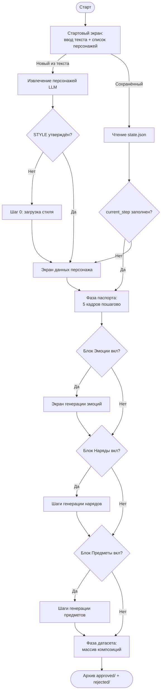

### Пайплайны ИИ на входных шагах (НОВОЕ — наглядность):

**ИИ-пайплайн: извлечение персонажей (первый шаг):**
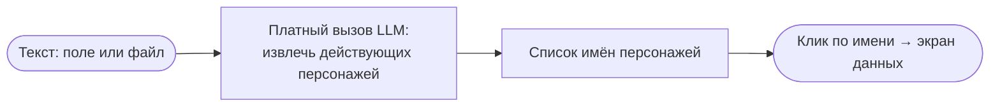

**ИИ-пайплайн: промт стиля (если STYLE ещё не утверждён):**
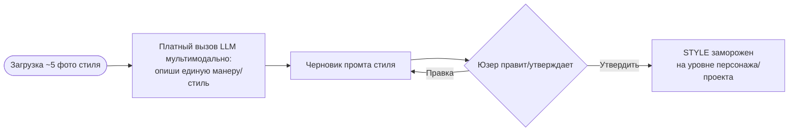

**ИИ-пайплайн: оптимизация [FACE]/[BODY] под модель (при сборке промта шага):**
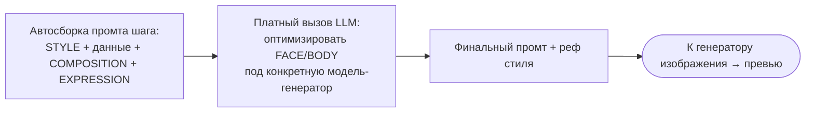


### Стек: Gradio + Spaces (CPU), НЕ Streamlit
- Gradio тянет пошаговый мастер с состоянием (gr.State), gr.Gallery, условный рендер.
- Деплой в Spaces в один клик.
- Space = тонкий ОРКЕСТРАТОР-фронтенд, который ходит в чужие API.
  Сам почти ничего не считает (CPU, дёшево/бесплатно).
- ВСЯ стоимость и ВСЕ лимиты — в API-вызовах (LLM + image-gen).

### Состояние сессии (в памяти; ЗЕРКАЛИТ state.json из §6):
```
session = {
  style_prompt,                 # утверждён на шаге стиля
  characters: [...],            # извлечены из текста
  current: {                    # = state.json текущего персонажа (см. §6), ключевые поля:
    character_table: {...},     # все поля таблицы персонажа
    emotions: {...},            # enabled, items[] (3 базовых + реф), base_emotion (default neutral)
    base_outfit: {...},         # промт базового наряда + frozen + ref (ОТДЕЛЬНО от outfits)
    outfits: [...],             # ТОЛЬКО доп-наряды; промты, рефы по сценам, детали, "сложный"
    outfits_enabled,            # флаг блока доп-нарядов
    active_outfit_id,           # активный наряд ("base" или id доп-наряда)
    props_enabled, props: [...],# флаг + предметы/магия (1-3 кадра, что это + промт + реф)
    prompt_layers: {...},       # распарсенные слои (style/face/body/outfit/expression/composition)
    steps: {...},               # по шагам: last_path / approved_path / prompt_layers / need_regen
    current_step,               # очищается при завершении пайпа
  }
}
```
Состояние сессии зеркалит state.json из бакета (§6) и сохраняется туда после каждого
значимого действия. ПОЛНАЯ схема полей — в §6 (state.json — источник истины).

### МИНИМУМ полей в табличке персонажа:
- Пол — ОБЯЗАТЕЛЬНО (без него модель кидает монетку).
- Возраст — можно дефолтом "adult / средних лет", но лучше оставить (разлёт 20 vs 50).
Поля для качества промта (не критичны для выживания):
- Телосложение (худой/атлет/грузный/коренастый)
- Цвет волос + длина/тип (короткие/длинные/лысый/борода)
- Цвет глаз
- Тон кожи
- Одежда/роль (раб, воин, знатный) — сильно помогает
- Произвольные детали (большой textarea): шрамы, повязка, тату, деревянная нога —
  самое ценное поле.

### Сколько фоток стиля грузить: 5 (оптимум)
Где лица крупно и видна манера. Больше 5 не нужно — LLM не точнее, токенов жрёт больше.

### Сколько референсов крепить к генерации (ЗАФИКСИРОВАНО):
- **Эталонный набор: 2 рефа — фас-портрет (лицо) + фас полный рост (тело)** + 1 реф стиля.
- Начинаем с 2. Добавляем 3/4-лица и 3/4-рост ТОЛЬКО если объём тела/идентичность поплывут.
- Nano Banana Pro технически до 14 рефов, но больше — каша. Оптимум 2-3 (+стиль).
- Крепить ролями (фас=лицо, рост=тело, стиль=манера), гасить костюмный конфликт (§3.5).

---

## 5. ФИЧИ ПРИЛОЖЕНИЯ

**Схема взаимодействия — Экран данных персонажа:**
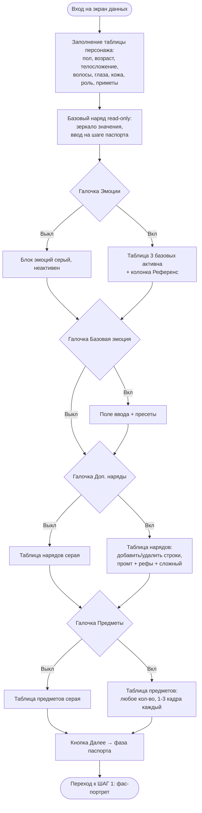

### Блок «Эмоции» на экране данных персонажа (НОВОЕ, модель пересмотрена):
Расположение: сверху таблицы данных по персонажу — поле с галочкой (чекбоксом) «Эмоции».
- Под галочкой — табличка эмоций.
- Галочка ВЫКЛЮЧЕНА (по умолчанию) → весь блок НЕАКТИВЕН, приглушён серым (disabled-стиль).
- Галочка ВКЛЮЧЕНА → табличка активна, кликабельна, нормальные цвета.

Состав таблички эмоций (НОВАЯ модель — весь блок опционален):
- **3 базовых** (`neutral`, `angry/furious`, `smiling warmly`) — перебираются, когда блок включён.
- Конструкция «3 залоченных всегда + 2 ситуативных переключаемых» и «потолок 5» — ОТМЕНЕНА.
  Теперь блок эмоций целиком под галочкой (опционален), без обязательных и без ситуативных.
- **Колонка «Референс»** в таблице: для каждой эмоции — ссылка на сгенерированный реф
  (появляется после генерации, аналогично колонке рефов в таблице нарядов). До генерации пусто.

(Обоснование — см. файл решений HLE-661, Решение 5 в переписанной редакции.)

### Блок «Базовая эмоция персонажа» (НОВОЕ, под блоком базовых эмоций):
Порядок элементов сверху вниз:
1. Галочка (вкл/выкл всего блока).
2. Надпись «Базовая эмоция персонажа».
3. Поле ввода текста (свободный ввод — юзер может вписать своё значение по-английски).
4. Кнопка «(…)» справа — открывает список пресетов с русскими описаниями. Клик по пресету → его значение прописывается в поле ввода.

Подсказка над/под полем: «короткое слово или фраза по-английски, как в примерах».

**Правило применения (КРИТИЧНО):** базовая эмоция есть у КАЖДОГО персонажа. Если она задана
явно — подставляется в [EXPRESSION] во ВСЕХ генерациях, КРОМЕ: (1) 5 паспортных кадров — там
принудительно neutral; (2) генераций из серии эмоций — там берётся заданная эмоция серии.
Если базовая эмоция НЕ задана явно (галочка выключена или поле пустое) — её значение = neutral.
То есть «эмоция по умолчанию» = base_emotion.value или neutral. (См. файл решений, Решение 5.)

**Список пресетов** (значение в поле → русское описание):
| Значение | Описание |
|---|---|
| `calm, composed` | Спокойный, собранный — невозмутимое, нейтрально-уверенное лицо |
| `grim, brooding` | Мрачный, угрюмый — тяжёлый взгляд, сведённые брови (без открытой злости) |
| `stern, serious` | Суровый, серьёзный — жёсткое сосредоточенное лицо, без тепла |
| `confident, slight smirk` | Уверенный, с лёгкой ухмылкой — спокойная насмешка, превосходство |
| `warm, friendly` | Тёплый, дружелюбный — мягкое открытое лицо |
| `tired, weary` | Усталый, измотанный — опущенные веки, тяжесть в лице |
| `cold, detached` | Холодный, отстранённый — бесстрастность, дистанция, «маска» |
| `cunning, sly` | Хитрый, лукавый — прищур, едва заметная усмешка, расчёт |
| `melancholic, sad` | Меланхоличный, печальный — тихая грусть фоном, опущенный взгляд |
| `arrogant, haughty` | Надменный, высокомерный — приподнятый подбородок, взгляд свысока |
| `anxious, wary` | Тревожный, настороженный — напряжение, насторожённый взгляд |
| `kind, gentle` | Добрый, мягкий — спокойная теплота, незлобивое лицо |

### Экран генерации эмоций (НОВОЕ):

Это отдельная ФАЗА после паспорта (если блок «Эмоции» включён), ДО нарядов.
Кадр эмоции — **портретный** (head & shoulders), одного достаточно чтобы зафиксировать мимику.

**Схема взаимодействия — Экран генерации эмоций:**
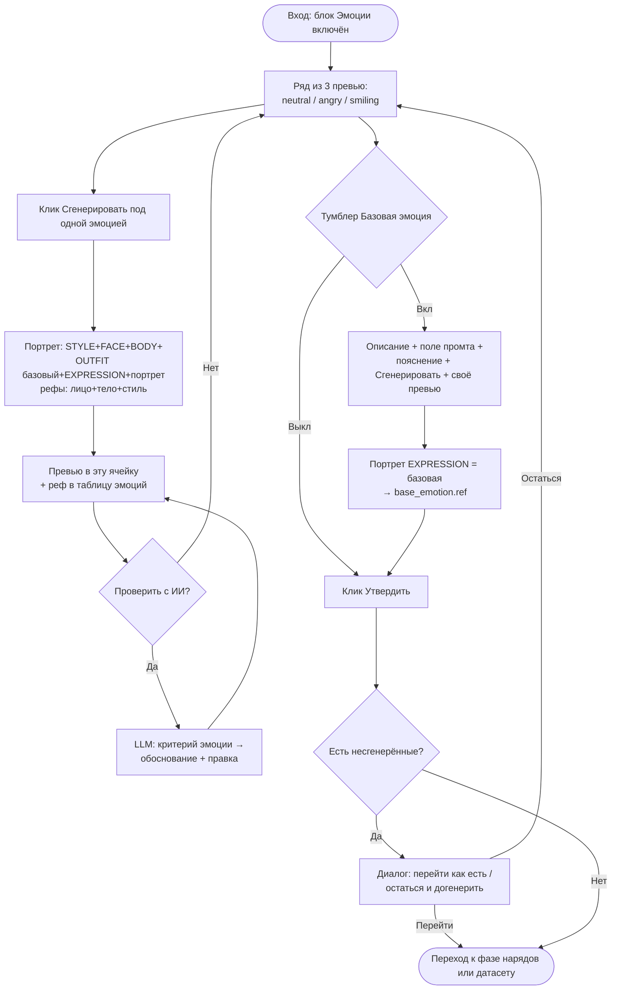

**Ряд из 3 превью** — по одному на каждую базовую эмоцию (neutral / angry, furious /
smiling warmly). Над каждым превью — заголовок с названием эмоции.
- Под КАЖДЫМ превью — **своя** кнопка «Сгенерировать» (генерит ТОЛЬКО этот реф, не все три).
  Перегенерация точечная: жмёшь под нужной — переделывается только она.
- Финальный промт кадра эмоции: STYLE + FACE + BODY + OUTFIT (базовый наряд) +
  EXPRESSION (эта эмоция) + COMPOSITION (портрет). Рефы: **лицо + тело + стиль**
  (в отличие от детали костюма — здесь идентичность НУЖНА).
- OUTFIT здесь — базовый наряд (доп-нарядов на фазе эмоций ещё нет, они идут позже).
- Реф каждой эмоции пишется в `emotions.items[].ref` и в колонку «Референс» таблицы эмоций.

**Тумблер «Базовая эмоция»** (под рядом превью) — вкл/выкл:
- Начальное значение = то, что введено в данных персонажа; правится здесь, изменение
  синкается обратно в данные персонажа (как тумблер «Сложный наряд»).
- ВКЛЮЧЁН → появляется:
  1. Описание: что такое базовая эмоция и как используется (подставляется ВМЕСТО нейтрали
     как дефолтная мимика во всех дальнейших генерациях / при обучении LoRA).
  2. Поле ввода **промта эмоции**.
  3. Пояснение под полем: что вводить (короткое выражение по-английски) и чего не вводить
     (не описывать одежду/позу/фон — это другие слои).
  4. Кнопка «Сгенерировать» справа от поля + **своё превью** базовой эмоции рядом.
- Кадр базовой эмоции: тот же портрет, EXPRESSION = значение базовой эмоции (НЕ neutral),
  рефы лицо+тело+стиль, OUTFIT базовый. Реф пишется в `base_emotion.ref`.

**Кнопка «Утвердить» (вся страница):**
- Рефы эмоций ОПЦИОНАЛЬНЫ: если остались несгенерированные элементы → диалог
  «перейти как есть / остаться и догенерировать рефы».
- Разрешаем перейти с НЕПОЛНЫМ набором рефов — возможно, они юзеру не нужны.
  (Отличие от наряда, где обязательные сцены блокируют переход.)
- При переходе сохраняем что есть, помечаем шаг выполненным.


### Блок «Базовый наряд» — часть данных персонажа (НОВОЕ, read-only на экране данных):

Базовый наряд — СВОЙСТВО персонажа. На экране данных показывается БЛОКОМ СВЕРХУ
(в самом начале, сразу под таблицей данных персонажа, ДО блока эмоций), но **read-only** —
только просмотр текущего значения, здесь НЕ редактируется. До генерации паспорта — пусто
(плейсхолдер «задаётся на шаге паспорта»).
- Хранится верхнеуровневым `base_outfit` (НЕ внутри `outfits[]`).
- **Единственное место ВВОДА — шаг паспорта:** на ШАГЕ 1 (фас-портрет) поле OUTFIT активно
  (одежда на плечах уже в кадре), на ШАГЕ 2 (фас-рост) докручивается. МОРОЗИТСЯ после
  утверждения фас-рост (`body_frozen == true`). После заморозки везде read-only.
- Существует ВСЕГДА, даже если блок «Дополнительные наряды» выключен. Эмоции, предметы
  и датасет, где «OUTFIT базовый», берут именно `base_outfit`.

### Блок «Дополнительные наряды» (OUTFIT) на экране данных персонажа (НОВОЕ):

Расположение: на экране данных персонажа, ПОД блоком эмоций — галочка «Дополнительные наряды».
По умолчанию ВЫКЛЮЧЕНА. Выключена → блок заморожен, подсвечен серым (disabled). Включена →
таблица активна, можно добавлять/удалять строки. Содержит ТОЛЬКО доп-наряды сверх базового
(базовый наряд — отдельный блок выше, сюда НЕ входит).

**Таблица доп-нарядов** (строки добавляются/удаляются при включённой галочке):
- Колонка **промт наряда** (текст слоя OUTFIT).
- Колонка **Референсы** — перечислены ВСЕ утверждённые рефы наряда (фас-рост, спина-рост,
  опц. профиль-рост; ссылки появляются по мере согласования).
- Колонка **«Сложный наряд»** — галочка.
- Всё сохраняется в данные персонажа и подтягивается при повторном открытии.

**ПОРЯДОК ФАЗ (КРИТИЧНО):** шаги по нарядам идут ПОСЛЕ эмоций, если блок эмоций включён;
иначе — сразу после паспорта. Итоговая последовательность:
паспорт (5) → [эмоции, если вкл] → [наряды, если вкл] → [предметы, если вкл] → фаза датасета.

#### Шаг генерации наряда (на каждую строку таблицы — свой шаг):

**Схема взаимодействия — Шаг генерации наряда:**
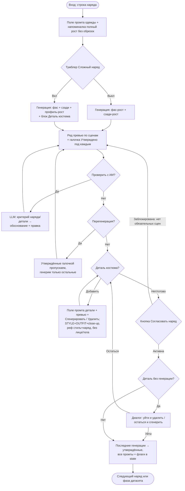

- Описание для пользователя: что ввести в промт слоя одежды.
- Поле ввода промта одежды (из таблицы, может быть пустым).
- **Напоминалка под описанием:** важно получить именно ПОЛНЫЙ РОСТ, без обрезок.
- Тумблер **«Сложный наряд»** — равен значению галочки из таблицы; изменение тут (вкл/выкл)
  меняет и галочку в данных персонажа. При включении появляется поле ввода **промта детали
  костюма** + блок(и) деталей (ниже).
- **EXPRESSION при генерации наряда:** базовая эмоция, если включена; иначе neutral.

**Основные сцены наряда:**
- Первая генерация по промту наряда создаёт СРАЗУ: «фас рост» + «сзади рост».
  Если наряд сложный — ещё «профиль рост» (3 картинки).
- Под полем промта — ряд превью по сценам: простой = 2 (фас, сзади), сложный = 3 (+профиль).
  Выключение «Сложный» убирает превью профиля, включение — добавляет.
- Под каждым превью — галочка **«Утверждено»**. Назначение галочки — ТОЛЬКО оптимизация:
  при повторной генерации сцены с утверждённой галочкой НЕ перегенерируются. На разблокировку
  кнопки согласования галочка НЕ влияет.

**Кнопка «Согласовать наряд»:**
- Заблокирована, пока НЕТ последних генераций по всем обязательным сценам:
  фас + сзади (простой), + профиль (сложный). Завязка на наличие генераций, НЕ на галочки.
- При нажатии: последние генерации обязательных сцен сохраняются как утверждённые рефы наряда,
  ВСЕ итоговые промты (наряда + всех деталей) и флаг сложности сохраняются в данные персонажа,
  наряд становится активным (`active_outfit_id` = его id),
  шаг помечается выполненным, переход к следующему шагу.
- Если в деталях осталась строка с заполненным промтом, но без генерации → диалог:
  «при переходе этот промт удалится. Уйти и удалить / Остаться и сгенерировать».
- Выключение «Сложный» после того как профиль уже сгенерён → реф профиля ПРЯЧЕМ, не удаляем;
  при согласовании, если «Сложный» выключен, профиль просто не идёт в утверждённые.
  Вернул тумблер — превью и реф на месте. Ничего не удаляем автоматически.

#### Блок «Деталь костюма» (крупный план, опционален даже для сложного наряда):
- Появляется при включённом тумблере «Сложный наряд».
- Описание над полем: деталь — это КРУПНЫЙ ПЛАН на детали костюма (макро).
- Поле ввода промта детали + справа от поля **превью последней генерации** этой детали.
- Под полем — кнопки **«Сгенерировать»** и **«Удалить»**.
- **«Сгенерировать»:** финальный промт детали = STYLE-слой + OUTFIT-слой этого наряда +
  COMPOSITION (extreme close-up / detail shot + текст из поля детали).
  Рефы: **реф стиля + утверждённый фас-рост ЭТОГО наряда**. БЕЗ FACE/BODY/EXPRESSION —
  деталь единственный кадр, где идентичность персонажа не нужна (нужен только костюм).
- **«Удалить»:** если по детали уже есть генерация → диалог «Вы уверены?»; если генерации
  не было — просто убираем блок детали.
- **Мультидетали:** кнопка «добавить деталь» → под последним блоком детали появляется
  ещё один такой же (свой промт, своя генерация). Юзер может удалить любые строки деталей.
- В данные персонажа сохраняется КАЖДАЯ деталь: `prompt` (текст) + `ref` (если сгенерён).


### Колонка «Референс» в таблице эмоций (НОВОЕ):
В таблице эмоций добавляется колонка со ссылкой на сгенерированный реф эмоции — аналогично
колонке рефов в таблице нарядов. Ссылка появляется после генерации, до этого пусто.


### Блок «Предметы» (PROPS / реквизит и магия) на экране данных персонажа (НОВОЕ):

4-й блок на экране персонажа, ПОД нарядами — галочка «Предметы». По умолчанию ВЫКЛЮЧЕНА
(блок серый/неактивен). Включена → таблица активна. Механика — как у нарядов.
Сюда же идут **магия/эффекты** (промт описывает эффект, а не объект — отдельной категории нет).

**Таблица предметов** (привязаны к персонажу, ПРОИЗВОЛЬНОЕ количество строк):
- Колонка **название/описание предмета**.
- Колонка **референсы** — список сгенерированных кадров предмета (1–3).
- Добавить/удалить строки при включённой галочке.
- Всё (описания + промты + рефы) сохраняется в данные персонажа, подтягивается при возврате.

**Порядок фаз (обновлён):** паспорт (5) → [эмоции] → [наряды] → [предметы] → датасет.
Все опциональные фазы — только если соответствующий блок включён.

#### Шаг генерации предмета (на каждую строку таблицы — свой шаг):
- **1 кадр по умолчанию**, можно добавить ещё, **МАКСИМУМ 3 кадра на предмет**.
- Каждый кадр — свой блок: **поле «что это» (описание от пользователя)** + поле промта +
  превью + кнопки «Сгенерировать» / «Удалить». Кнопка «добавить кадр» активна, пока кадров < 3.
- **Генерация — БЕЗ персонажа** (отдельная картинка предмета/эффекта): финальный промт =
  STYLE-слой + промт кадра. Реф: **только стиль**. БЕЗ FACE/BODY/OUTFIT/EXPRESSION
  (как деталь костюма, но даже без рефа наряда — предмет самостоятелен).
- **Промты сохраняются** для каждого кадра (даже если реф ещё не сгенерён).
- Product-shot: предмет/эффект на нейтральном фоне, чисто, без рамок/надписей.

**Схема взаимодействия — Шаг генерации предмета:**
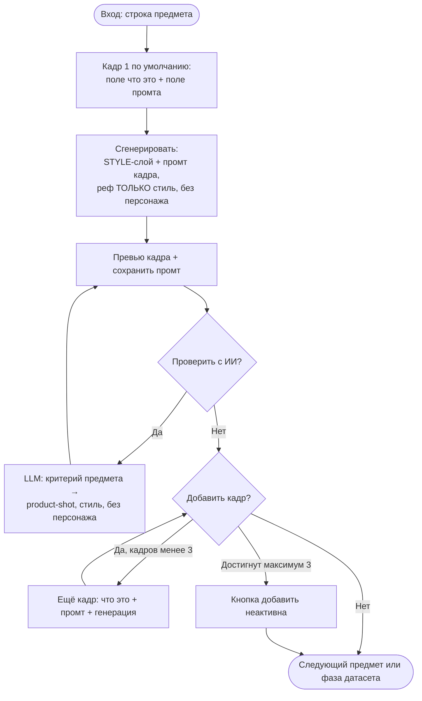

### Паспортные кадры — предупреждения и критерии на экране генерации (НОВОЕ):

**Схема взаимодействия — Шаг паспорта (единая форма шага):**
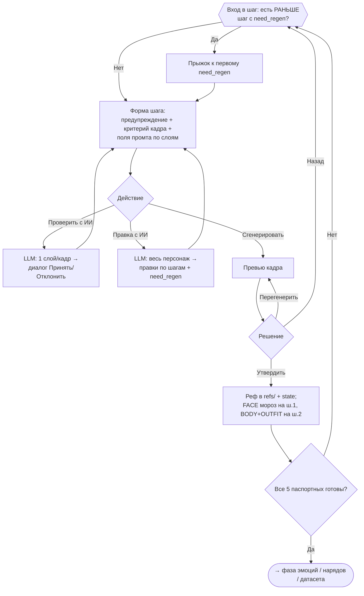

Паспортный набор = 5 кадров (см. файл решений, Решение 1). На экране генерации КАЖДОГО из них
вывести заметным текстом: «Это базовый кадр для идентичности персонажа. Важно, чтобы он
соответствовал критериям ниже — от него зависит весь дальнейший набор».

Критерий кадрирования — СВОЙ для каждого кадра (порядок = канон флоу §4):
1. **Фас-портрет:** чёткий фас, лицо смотрит прямо в камеру, head & shoulders.
2. **Фас полный рост:** полный рост БЕЗ обрезок (от волос до обуви целиком в кадре), фас, стопы на земле.
3. **Профиль-портрет:** строгий профиль 90°, видна только одна сторона лица (рычаг «only one eye visible»), head & shoulders.
4. **Спина полный рост:** полный рост без обрезок, вид со спины, видны затылок/причёска/спина/одежда сзади.
5. **3/4 полный рост:** полный рост без обрезок, полуоборот (3/4), стопы на земле.

Общее для всех 5: нейтральное выражение лица (принудительно neutral); ровный серый
(нейтральный) фон; мягкий равномерный студийный свет; БЕЗ рамок комикса, надписей, реплик,
подписей-плашек и любых артефактов на фоне; без посторонних объектов/людей.

Запрет для блоков промта [FACE] и [BODY] (вывести подсказкой прямо над/у поля ввода):
«Только анатомия и физические приметы: форма лица, нос, губы, глаза, волосы, кожа,
телосложение, шрамы/тату/особые приметы. ЗАПРЕЩЕНО писать сюда выражения лица, эмоции,
состояния, позы, одежду, фон — это другие слои (EXPRESSION / OUTFIT / COMPOSITION).»

### Реестр готовых промтов [COMPOSITION] (НОВОЕ — заполняется):

Паспортные кадры — ЗАФИКСИРОВАНЫ (точные промты):

**Фас-портрет:**
```
Front facing portrait, head and shoulders, plain neutral grey background, soft
even lighting, calm neutral expression, no harsh shadows, no blood, no dramatic
backlight, no text, no speech bubbles, no caption box, no panel border, no frame,
no lettering, just the character on a clean background.
```

**Фас полный рост:**
```
Full-length character reference, head-to-toe, the entire body from hair to shoes
fully inside the frame. Standing straight, both feet flat on the ground, legs and
footwear clearly visible, empty space above the head and below the feet. Small
figure in frame, camera pulled far back. Plain neutral grey background, soft even
lighting, neutral expression, arms relaxed at sides, no text, no panel border,
no frame, no lettering.
```

**Профиль-портрет:**
```
Strict side profile, head facing 90 degrees to the side, only one eye visible,
nose and lips seen in silhouette against the background, ear fully visible, head
and shoulders, plain neutral grey background, soft even lighting, no text, no
panel border, no frame, no lettering.
```

**3/4 полный рост:**
```
Full-length character reference at a three-quarter angle, body turned about 45
degrees, head-to-toe, the entire body from the top of the hair down to the soles
of the shoes fully inside the frame. Standing straight, both feet flat on the
ground, legs and footwear clearly visible. Clear empty margin above the head and
below the feet, full figure framed with generous headroom and footroom. Small
figure in frame, camera pulled far back, full body wide shot, no cropping, not a
close-up, nothing cut off at the edges. Plain neutral grey background, soft even
lighting, neutral expression, arms relaxed at sides, no text, no panel border,
no frame, no lettering.
```

**Спина полный рост:**
```
Full-length character reference seen from behind, back view, head-to-toe, the
entire body from the top of the hair down to the soles of the shoes fully inside
the frame. Back of the head, hairstyle, back, and clothing from behind clearly
visible. Standing straight, both feet flat on the ground, legs and footwear
visible. Clear empty margin above the head and below the feet, full figure framed
with generous headroom and footroom. Small figure in frame, camera pulled far
back, full body wide shot, no cropping, not a close-up, nothing cut off at the
edges. Plain neutral grey background, soft even lighting, arms relaxed at sides,
no text, no panel border, no frame, no lettering.
```

**Профиль полный рост** (усилен против разворота к камере):
```
Full-length character reference in strict side profile view, the character's
entire body and head turned 90 degrees to the side, facing screen-left, looking
straight ahead in the direction they are facing, NOT toward the camera. Pure
lateral view: only one side of the face is visible, only one eye, one eyebrow and
one ear shown, the bridge and tip of the nose form a clear outline against the
background, the far cheek and far eye are completely hidden behind the head. The
shoulders, hips and feet are also rotated to the side, one shoulder in front of
the other, body in full lateral orientation. Head-to-toe, the entire body from
the top of the hair down to the soles of the shoes fully inside the frame.
Standing straight, both feet flat on the ground, legs and footwear visible. Clear
empty margin above the head and below the feet, full body wide shot, camera
pulled far back, full figure framed with generous headroom and footroom. Plain
neutral grey background, soft even lighting, neutral expression, arms relaxed at
sides, no text, no panel border, no frame, no lettering. Not a three-quarter view,
not facing the camera, face shown completely from the side.
```

Привязка сцен к фазам:
- **Костюмы (наряды):** фас-рост + спина-рост; для сложного наряда +профиль-рост.
- **Эмоции:** фас-портрет (кадр в камеру — мимика читается анфас).

Датасетная фаза (локалка) — НАЗВАНЫ, промты НЕ написаны (§8, открытый массив [COMPOSITION]):
- проходка (walking), сидя (sitting), вид сверху (high angle), вид снизу (low angle),
  наклоны головы.

Боевое обогащение (Решение 3) — НАЗВАНЫ, промты НЕ написаны:
- боевая стойка, замах/удар, каст, +«вид снизу полный рост».


### Кнопка «Проверить с ИИ (платный вызов API)» (НОВОЕ):
Расположение: справа от поля ввода промта (FACE или BODY). Надпись с явной пометкой про
платный вызов — разместить так, чтобы юзер её точно видел (рядом: «Не уверены — нажмите…»).

Поведение по нажатию:
1. Собрать ПОЛНЫЙ промт всех слоёв (STYLE/FACE/BODY/OUTFIT/EXPRESSION/COMPOSITION).
2. Если превью кадра уже сгенерировано — прикрепить картинку (base64) к запросу.
3. Отправить в LLM с вопросом, проверяющим ТРИ вещи:
   а) Непротиворечивость слоёв: не противоречит ли проверяемый слой (FACE/BODY) остальным,
      не залезает ли в чужую зону (эмоции/поза/одежда/фон вместо анатомии).
   б) Соответствие КРИТЕРИЯМ паспортного кадра (нужный ракурс/кадрирование, нейтральное
      выражение, серый фон, мягкий студийный свет, без рамок/надписей/артефактов).
   в) Если приложено превью — подходит ли сама картинка под промт и под критерии.
4. При ЛЮБОМ несоответствии (текст промта или картинка) — LLM даёт рекомендации/исправленный промт.
5. Формат ответа LLM — ЕДИНЫЙ во всём приложении: `{обоснование}[новый промт]`
   (фигурные = текст для юзера, квадратные = новый промт, может быть пустым).
6. Парсинг:
   - Текст из {…} показываем юзеру всегда (замечания / «всё ок»).
   - Если [новый промт] НЕ пустой — диалоговое окно: обоснование + новый промт +
     вопрос «Принять изменения?». «Да» → пишем в основное поле (FACE/BODY). «Нет» → не меняем.
   - Если [новый промт] пустой — замечаний по промту нет, форму не трогаем.

(Родственно «кнопке проверка llm» для композиции — формат скобок у обеих теперь ОДИН:
`{обоснование}[промт]`. Различие: composition-кнопка проверяет картинку vs промт; FACE/BODY-кнопка
проверяет непротиворечивость слоёв + соответствие критериям + (если есть превью) картинку.
Обе = отдельный платный вызов.)

#### Распространение «Проверить с ИИ» на ВСЕ блоки (НОВОЕ):

Кнопка «Проверить с ИИ» присутствует на КАЖДОМ шаге генерации (рядом с полем промта).
Выход всегда один — `{обоснование}[новый промт]`, парсер общий. Меняется ТОЛЬКО критерий
проверки под тип шага (LLM получает чек-лист соответствующего типа). «Правка с ИИ»
(глобальная) НЕ распространяется — остаётся только на паспорте/датасете.

Критерий по типу шага:

| Тип шага | Что проверяет LLM (критерий) | Прикладывать превью |
|---|---|---|
| Паспорт (FACE/BODY) | изоляция слоёв (анатомия не лезет в эмоцию/позу/одежду/фон); критерии паспорта (ракурс/кадрирование, neutral, серый фон, мягкий свет, без рамок/надписей) | да, если есть |
| Эмоция | EXPRESSION = короткое выражение (не описание мимики прозой, не поза/одежда/фон); кадр портретный; выражение читается на лице | да, если есть |
| Наряд (сцена) | OUTFIT описывает ТОЛЬКО одежду (не анатомию/позу); кадр — полный рост без обрезок (для нужной сцены: фас/сзади/профиль); серый фон | да, если есть |
| Деталь костюма | промт = макро/крупный план детали; деталь принадлежит этому наряду; БЕЗ требований к лицу/телу (идентичность не проверяем) | да, если есть |
| Предмет / магия | промт описывает предмет/эффект как product-shot; нужный стиль; чистый нейтральный фон; БЕЗ персонажа (лицо/тело/одежда не должны фигурировать) | да, если есть |
| Композиция (датасет) | картинка соответствует промту композиции (поза/ракурс/кадр/фон); активный OUTFIT и эмоция на месте | да (мультимодально) |

Реализация: одна функция проверки, на вход — тип шага → подставляет нужный чек-лист в промт
к LLM. Поле, куда писать `[новый промт]`, — промт ТЕКУЩЕГО шага (FACE/BODY/OUTFIT/EXPRESSION/
промт предмета/композиции соответственно).

**Пайплайн ИИ-вызова «Проверить с ИИ»:**
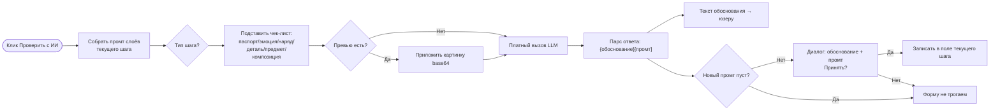

### Каскад при перегенерации паспортных (ОБНОВЛЕНО):
- НЕ сбрасываем фотки автоматически.
- Оставляем всё, вешаем ЗАМЕТНОЕ раздражающее предупреждение на каждой странице
  после отменённой: "ты перегенерил референс N — лицо/тело могли разъехаться,
  проверь и при необходимости перегени и эти".
- Юзер сам решает (может не сильно разъехалось).

### Фаза датасета — массив композиций (схема взаимодействия):
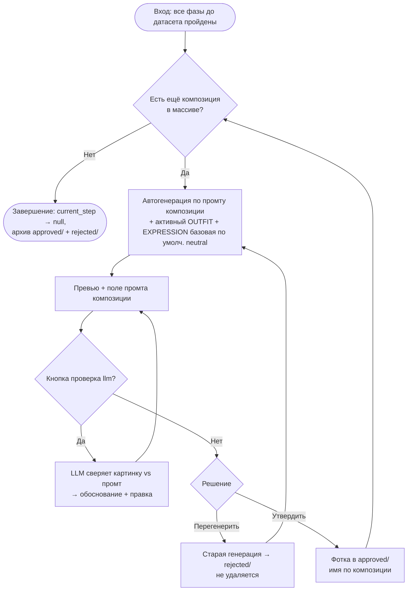

### Финальный архив — ДВЕ папки:
- approved/ — имена по композиции.
- rejected/ — имена по композиции + номер попытки.
- Неутверждённое тоже полезно для датасета (вариативность).

### ПРАВИЛО ПРОЕКТА: отклонённые генерации НЕ удаляются (НОВОЕ):
- У КАЖДОГО персонажа есть папка `rejected/` — туда складываются все неутверждённые
  генерации, и они НИКОГДА не удаляются автоматически (вдруг пригодятся для датасета).
- Явной кнопки «Отклонить» НЕТ. Отклонение происходит АВТОМАТИЧЕСКИ: при «Перегенерить»
  предыдущая генерация уходит в `rejected/` (+ № попытки), а не затирается.
- Действует на ВСЕХ фазах, где есть перегенерация (паспорт, эмоции, наряды, предметы,
  датасет): старый кадр → rejected/, не теряется.
- Единственное ручное удаление в приложении — «Удалить» у деталей костюма / кадров предмета
  (это удаление СТРОКИ ввода, а не архивация генерации).

### Рандомный фон:
- Хардкод-массив промтов фона, random.choice() в [COMPOSITION].
- Плюс поле ввода снизу для корректировки/override перед генерацией.

### Кнопка "проверка llm" (рядом с полем композиции):
- Отправляет текущий промт + превью (base64) в мультимодальный LLM.
- Вопрос: "проверь изображение на соответствие промту, при ошибке выдай исправленный
  промт в формате {описание ошибки, описание решения} [новый промт]".
- ФОРМАТ ЕДИНЫЙ с кнопкой проверки FACE/BODY: `{обоснование}[новый промт]` (фигурные —
  текст юзеру, квадратные — новый промт, может быть пустым). Один парсер на обе кнопки.
- Парсим: текст из {} показываем юзеру; [новый промт] если не пустой — пишем в поле
  и слегка подсвечиваем поле ввода.
- При нажатии перегенерации подсветку снимаем.
- ВНИМАНИЕ: каждый клик = ещё один платный мультимодальный вызов.

### Список сохранённых персонажей на стартовом экране (НОВОЕ):

**Схема взаимодействия — Стартовый экран:**
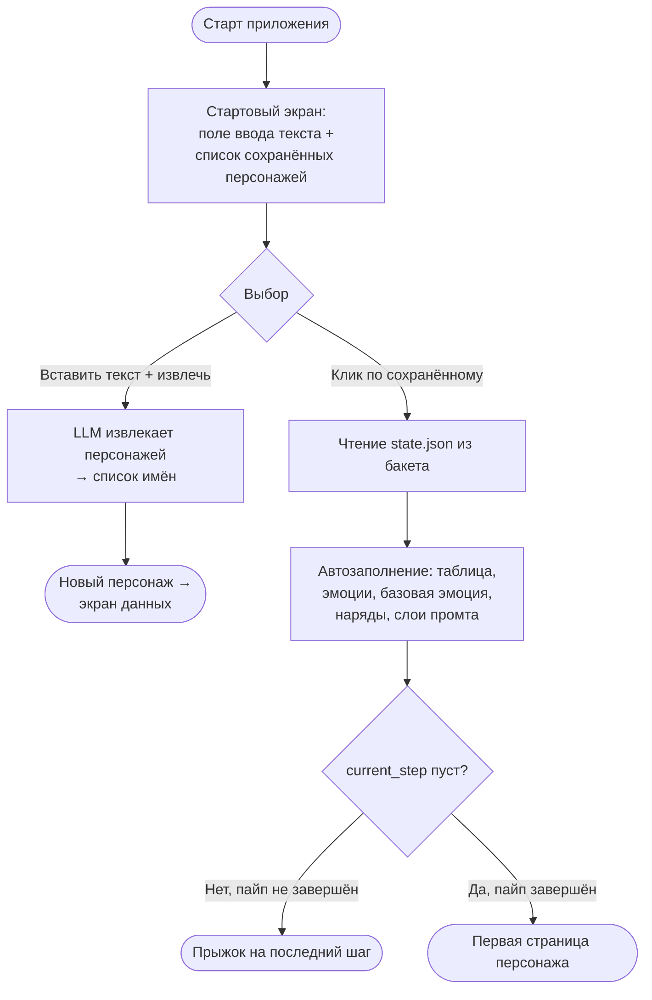

На начальном экране (где из текста выбираем персонажа для генерации) — отдельное окно/список
УЖЕ СОЗДАННЫХ персонажей (читается из бакета, по папкам с state.json).

По клику на персонажа:
1. Читаем его state.json из бакета.
2. Автозаполняем формы: таблицу персонажа, флаг «Эмоции» + базовую эмоцию (галочка +
   значение), флаг «Дополнительные наряды» + таблицу нарядов, распарсенные по слоям промты.
3. Определяем, куда переключиться:
   - Если `current_step` НЕ пустой (пайп не завершён) → прыгаем на этот последний шаг,
     подгружаем его превью/промт.
   - Если `current_step` пустой/null (пайп завершён, шаг очищен при финише) → открываем
     ПЕРВУЮ страницу.

### Кнопка «Правка с ИИ (платный вызов)» — мульти-шаговый ревью (НОВОЕ):
Отличие от «Проверить с ИИ»: та проверяет ОДИН текущий слой/кадр. «Правка с ИИ» —
ревизует ВЕСЬ персонаж разом по свободному запросу юзера и возвращает правки сразу
по нескольким шагам.

Поведение:
1. По нажатию — диалог: надпись «Введите запрос, чего хотите добиться:», под ней
   многострочное поле ввода + кнопка «Отправить».
2. К LLM уходит: весь контекст персонажа (state.json — таблица, эмоции, базовая эмоция,
   все слои промта по всем шагам), текущее превью (base64, если есть) и запрос юзера.
3. LLM возвращает правки, СГРУППИРОВАННЫЕ ПО ШАГАМ, с маркером шага `&шаг&`.

Промт к LLM (черновик):
```
Ты — ревизор промтов для генерации консистентного персонажа в Nano Banana.
Дан полный контекст персонажа (данные, настройки, промты по слоям и шагам) и
запрос пользователя. Сделай следующее:
1. Выполни запрос пользователя, внеся правки в промты нужных шагов.
2. Дополнительно проверь по ВСЕМ шагам:
   - для паспортных кадров — соответствие критериям (нужный ракурс/кадрирование,
     нейтральное выражение, серый фон, мягкий студийный свет, без рамок/надписей/артефактов);
   - для остальных — непротиворечивость и изоляцию слоёв (FACE/BODY только анатомия,
     эмоции в EXPRESSION, одежда в OUTFIT, поза/фон в COMPOSITION), а также
     оптимальность формулировок под Nano Banana (описательный язык, явное указание
     что не меняется, без лишних негативов).
3. Верни ТОЛЬКО изменённые шаги. Для каждого — блок строго в формате:
   &<step_key>&
   {обоснование изменений}
   [новый полный промт шага]
Если по шагу правок нет — не включай его в ответ.
```
4. Парсинг: разбиваем ответ по маркерам `&шаг&`. Для каждого шага формируем блок.

Диалог результата:
- Для каждого затронутого шага — блок: «Новый промт» + «Обоснование», отсортированы
  в ОБЫЧНОМ порядке шагов пайпа.
- Рядом с каждым блоком — кнопка «Принять».
- При «Принять»: в state данного шага прописываем новый промт + ставим флаг
  `need_regen = true`.
- Внизу диалога — кнопка «Закрыть».

**Пайплайн ИИ-вызова «Правка с ИИ» (глобальный мульти-шаговый):**
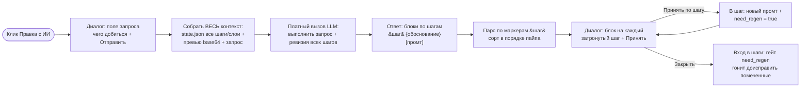

### Кнопки навигации (ОБНОВЛЕНО):
- На каждой странице: кнопка «Назад» + возможность перегенерировать.
- Кнопка «Вперёд» — активна, ТОЛЬКО если в state есть заполненные данные о следующем шаге
  (есть сохранённая генерация И промт следующего шага). Иначе неактивна/скрыта.
  Позволяет листать вперёд по уже пройденным шагам, не перегенерируя.

### Правило перехода с учётом флага перегенерации (НОВОЕ):
- При ЛЮБОМ переходе на следующий шаг — сначала проверяем, есть ли РАНЬШЕ в данных
  (на более ранних шагах) шаги с поднятым флагом `need_regen = true`.
- Если есть — переходим к ПЕРВОМУ такому шагу (а не на следующий по порядку).
  Это гонит юзера доисправить то, что пометил ИИ-правкой, прежде чем идти дальше.
- Флаг `need_regen` снимается (false) при нажатии «Перегенерить» или «Утвердить»
  на форме этого шага.
- Так гарантируем: нельзя проскочить мимо шага, который ждёт перегенерации после
  принятой ИИ-правки.


---

## 6. ПЕРСИСТЕНТНОСТЬ — Storage Buckets (НЕ старый /data диск)

- С конца марта 2026 HF Buckets монтируются как персистентные тома прямо в Spaces
  (настройки Space → секция "Storage Buckets": бакет + путь монтирования + режим).
- Бакет цепляется к контейнеру по пути, содержимое доступно как локальные файлы.
- Пишешь фотки в смонтированный путь (напр. /data/project) как в обычную папку,
  персистится в бакет, переживает рестарты.
- Бакеты НЕверсионируемые и изменяемые: удалил файл — реально исчез, платишь только
  за то, что лежит сейчас. Идеально для перегенераций/каскадного сброса (Git-датасет
  копил бы всю историю попыток).
- CDN включён, egress в соотношении 8:1 к объёму. Цены на hf.co/storage.
- Для прототипа объёмы копеечные (фотки = мегабайты).
- Подключение: huggingface_hub или hf://buckets/username/bucket-name. В Gradio просто
  пишешь в смонтированный путь.
- ВЫВОД: брать бакеты, не возиться со старым персистент-диском.

### ПОЛНАЯ ПЕРСИСТЕНТНОСТЬ СОСТОЯНИЯ ПЕРСОНАЖА (НОВОЕ):
В бакет сохраняем НЕ только фотки текущей генерации, а ВСЁ состояние по каждому персонажу,
чтобы можно было выйти и вернуться к работе с любого места.

Структура хранения — папка на персонажа, внутри JSON-состояние + папки с картинками:
```
/data/project/
  <character_id>/
    state.json            # всё состояние персонажа (ниже)
    refs/                 # утверждённые/последние генерации по шагам
    approved/             # финальный архив (имена по композиции)
    rejected/             # отклонённое (имена по композиции + № попытки)
```

state.json — сохраняем как минимум:
```
{
  "character_id": "...",
  "name": "...",
  "character_table": { ... },     # ВСЕ поля таблицы персонажа (пол, возраст,
                                  #   телосложение, волосы, глаза, кожа, роль, детали...)
  "emotions": {
    "enabled": false,             # флаг блока "Эмоции" (галочка). Весь блок опционален.
    "items": [                    # перебираемые эмоции (3 базовых), у каждой свой реф
      { "value": "neutral",        "ref": null },
      { "value": "angry, furious", "ref": null },
      { "value": "smiling warmly", "ref": null }
    ],
    "base_emotion": {
      "enabled": false,           # галочка "Базовая эмоция персонажа"
      "value": "",                # значение поля (пресет или свой текст)
      "ref": null                 # реф базовой эмоции (портрет, EXPRESSION = value)
    }
    # МОДЕЛЬ ПЕРЕСМОТРЕНА: убраны "ситуативные" и "потолок 5"; блок целиком под галочкой.
    # ПРАВИЛО EXPRESSION: базовая эмоция есть у ВСЕХ персонажей. Если base_emotion не задана
    #   явно (enabled=false или value="") — её значение = neutral. То есть "OUTFIT/эмоция
    #   по умолчанию" во всех фазах (наряды/предметы-нет/датасет) = base_emotion.value или neutral.
  },
  "base_outfit": {                # БАЗОВЫЙ НАРЯД — свойство персонажа, ОТДЕЛЬНО от outfits[]
    "prompt": "...",              # промт базового наряда (вводится в начале, с пояснениями)
    "frozen": false,              # морозится после утверждения фас-рост (body_frozen)
    "ref": null                   # утверждённый фас-рост (паспорт)
  },
  "outfits": [                    # ТОЛЬКО доп-наряды сверх базового (базовый — в base_outfit)
    # {
    #   "id": "outfit_1", "prompt": "...", "complex": true,
    #   "refs": { "front_full": "...", "back_full": "...", "profile_full": "..." },
    #   "details": [ { "prompt": "...", "ref": "refs/..." }, ... ]
    # }
  ],
  "outfits_enabled": false,       # флаг блока "Дополнительные наряды" (галочка)
  "active_outfit_id": "base",     # активный наряд на шаге/сцене ("липкий"); "base" = base_outfit.
                                  #   При согласовании доп-наряда он становится активным.
  "props_enabled": false,         # флаг блока "Предметы" (галочка)
  "props": [                      # ПРЕДМЕТЫ/реквизит/магия, привязаны к персонажу, любое кол-во
    # {
    #   "id": "prop_1",
    #   "name": "...",            # название/описание предмета (для таблицы)
    #   "shots": [                # 1..3 кадра на предмет
    #     { "what": "...",        # описание "что это" от пользователя
    #       "prompt": "...",      # промт кадра (сохраняется даже без рефа)
    #       "ref": "refs/..." }   # реф (если сгенерён)
    #   ]
    # }
  ],
  "prompt_layers": {              # промт, РАСПАРСЕННЫЙ ПО СЛОЯМ
    "style": "...",               # (заморожен на уровне проекта/персонажа)
    "face": "...",
    "body": "...",
    "outfit": "...",
    "expression": "...",
    "composition": "..."
  },
  "steps": {
    "<step_key>": {               # по каждому шагу пайпа
      "last_path": "refs/...",    # путь к ПОСЛЕДНЕЙ генерации шага
      "approved_path": "refs/...",# путь к УТВЕРЖДЁННОЙ генерации (если есть)
      "prompt_layers": { ... },   # слепок слоёв промта на момент шага
      "need_regen": false         # поднимается при принятии ИИ-правки (см. §5),
                                  #   снимается при «Перегенерить»/«Утвердить»
    }
  },
  "current_step": "<step_key>"    # текущий шаг; ОЧИЩАЕТСЯ (null) при завершении пайпа
}
```

Правила:
- Пути к файлам — относительно папки персонажа (переносимо).
- current_step очищается в null при ЗАВЕРШЕНИИ пайпа (дошли до конца). Это сигнал, что
  персонаж готов и при открытии надо плюхнуться на первую страницу, а не в середину.
- Сохранять state.json после каждого значимого действия (утверждение шага, смена флагов,
  правка промта), чтобы возврат был с актуального места.


---

## 7. СТОИМОСТЬ — пересмотр (была завышена)

- Прежняя прикидка $2-8/перс была по ВЕРХНЕЙ границе (новичок перегенерит по 5 раз).
- Реально при набитом глазе (утверждаешь с 1-2 попыток): ~15-20 генераций/перс.
- На Nano Banana ($0.04-0.13/шт) = ~$0.60-2.5/главный персонаж.
- Закладывать порядок $1-3 на главного перса генерацией + LLM-вызовы сверху.
- Не "$0", но и не разорительно.

### Подводные камни приложения (заложить сразу):
1. Стоимость API на длинном флоу — заложить, не "бесплатно".
2. Лимиты и ключи — нужен API-ключ к LLM (в секретах Space), обработка 429.
3. Image-gen: Space сам не рисует — дёргает Gemini/Nano Banana (платно, консистентно)
   или fal.ai/Replicate (дешевле, другая консистентность).
4. Обработка ошибок image-gen в UI: при фейле/таймауте/429 генератора — показать юзеру
   понятное сообщение (не пустое превью), кнопку «повторить», не терять введённый промт.
   Платный вызов мог не состояться — не списывать «успех», дать ретрай.

---

## 8. ОТКРЫТЫЕ ВОПРОСЫ / TODO

### Решения по контенту (надо проработать):
- [~] **Список композиций** — паспортная часть ЗАФИКСИРОВАНА, промты написаны (5 кадров
      в порядке: фас-портрет, фас-рост, профиль-портрет, спина-рост, 3/4-рост — то, что
      генератор не вытянет сам; см. файл решений HLE-661, Решения 1 и 7, и реестр промтов §5).
      ОСТАЁТСЯ: массив [COMPOSITION] для локального автопрохода датасета (проходка, сидя,
      ракурсы и т.п. — фаза локалки, генератор справится от паспортных рефов).
- [x] **Список эмоций** — ЗАФИКСИРОВАНО, модель ПЕРЕСМОТРЕНА (см. файл решений HLE-661,
      Решение 5). Блок «Эмоции» опционален: 3 базовых (neutral, angry/furious,
      smiling warmly) перебираются при включённом блоке; конструкция «3 залоченных +
      2 ситуативных» и потолок 5 — отменены. Плюс опциональная «Базовая эмоция персонажа»
      (одна, из пресетов или вручную), подставляется вместо neutral везде кроме паспорта.
      UI-блоки описаны в §5; колонка «Референс» в таблице эмоций.
- [ ] **Освещение — куда писать и трогать ли вообще?** Открытый вопрос:
      завести отдельным полем/слоем, или пихать в COMPOSITION, ИЛИ вообще не трогать
      на фазе набора (генерить весь датасет в мягком ровном свете), а драматичный свет
      добавлять потом автогенерацией поверх готовых референсов? Скорее всего: датасет
      в нейтральном свете (для консистентности лица), свет как ось — отложить.

### Решения по приложению (надо проработать):
- [⏸] **Обогащение боевыми/сюжетными сценами** — ОТЛОЖЕНО ОСОЗНАННО (не делаем сейчас).
      Решение: сначала смотрим, как локальная генерация (character-ref от паспорта) держит
      персонажа в динамике. Если идентичность в боевых позах НЕ плывёт — банановые экшн-кадры
      не нужны. Если плывёт — возвращаемся и добавляем 5-м опциональным блоком на персонаже
      по тому же паттерну (галочка → таблица → шаг), как наряды/предметы. Архетипы из
      Решения 3: боевая стойка, замах/удар, каст, нижний ракурс. Возврат ничего не ломает.
- [ ] **Кастомное добавление сцен пользователем** — свой ввод [COMPOSITION] сверх
      стандартного массива; пополняемый пользовательский список + сохранение в state.
- [ ] **Фоны — нужны ли на банане или всё на генератор?** Паспорт строго на сером фоне;
      сложный фон сбивает манеру и переобучает. Фиксировать ли фоны ключевых локаций
      на банане, или фоны целиком — задача локалки/сцены.
- [x] **Предметы и магия — отдельно.** ЗАФИКСИРОВАНО — блок «Предметы» (PROPS) описан в §5.
      Блок на персонаже (галочка), произвольное число предметов, 1–3 кадра на предмет,
      на каждый кадр описание «что это» + промт; генерация БЕЗ персонажа (только стиль).
      Магия/эффекты — сюда же. Фаза предметов после нарядов. Схема `props[]` — в §6.
- [x] **Одежда — реализация.** ЗАФИКСИРОВАНО — полный блок OUTFIT описан в §5
      («Дополнительные наряды»). Базовый наряд = нулевая запись, задаётся на лице,
      морозится с BODY; доп-наряды таблицей (промт + рефы + «сложный»); шаг генерации
      на наряд (фас-рост + сзади-рост, +профиль для сложного), крупные планы деталей,
      кнопка согласования с блокировкой; всё (промты + рефы + флаги) персистится.
      Порядок фаз: паспорт → [эмоции] → [наряды] → датасет. Схема `outfits[]` — в §6.
- [ ] **Защита от записи неверных значений в слой** (например, одежда в [BODY]).
      Вопрос: делать валидацию/защиту от записи, ИЛИ хватит подсказки-сообщения над
      полем ввода ("сюда телосложение и приметы, одежда — в поле OUTFIT")?
      Скорее всего для прототипа: текстовая подсказка над полем достаточна,
      жёсткую валидацию отложить.

### Технические TODO:
- [ ] Обновить инструкцию (md + docx) под 6 слоёв
      STYLE/FACE/BODY/OUTFIT/EXPRESSION/COMPOSITION + заметки про рост, эмоции, одежду.
- [ ] Скелет Gradio-приложения (состояние, шаги мастера, заглушки под API,
      реализация фич: каскадное предупреждение, проверка llm, два архива, бакет,
      референсы с ролями + гашение костюмного конфликта).
- [ ] Решить финально стиль А или Б (всё ещё не зафиксировано!).
- [x] Кол-во референсов — ЗАФИКСИРОВАНО: 2 рефа (фас-портрет + фас полный рост) +
      стиль. Начинаем с 2, 3/4-ракурсы добавляем только если поплывёт. См. §4 и
      файл решений HLE-661 (Решение 6).
- [ ] Linear: создать проект по сбору датасета персонажей, прикрепить этот листик
      (ждём ссылку на инициативу от Sergey).
